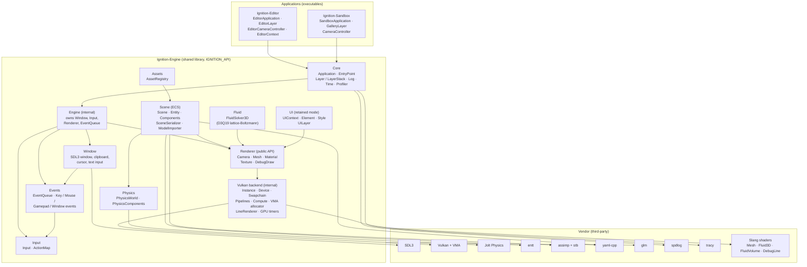
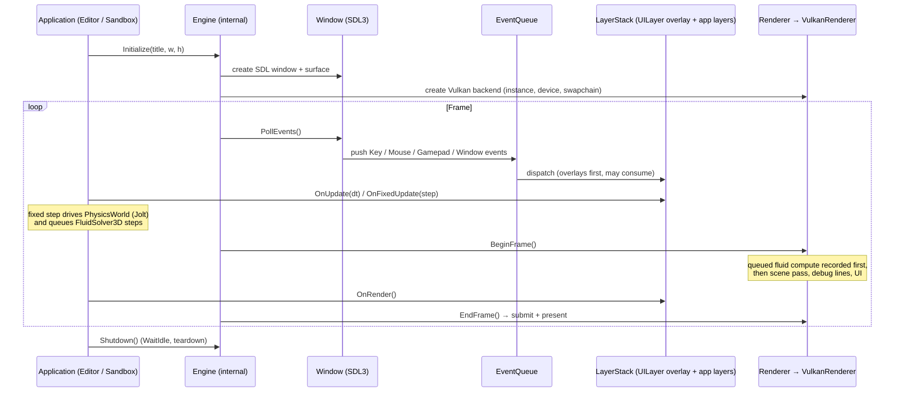

# Ignition — System Design

Ignition is a Vulkan-based C++ engine built as a shared library (`Ignition`) that hosts two
applications: the **Editor** (scene authoring) and the **Sandbox** (demo/feature gallery). Both
executables derive from `Ignition::Application` and are driven by the engine's `EntryPoint`.

## System Overview

## Runtime Composition

`Application` (public) owns an `ApplicationImplementation` (pimpl) that holds the internal
`Engine` plus the `LayerStack`. The `Engine` owns the platform and rendering objects and pumps
the frame:

## Subsystems

| Subsystem | Public API (`Include/Ignition`) | Internal (`Internal/Ignition`) | Backed by |
|---|---|---|---|
| Core | `Application`, `EntryPoint`, `Layer`/`LayerStack`, `Log`, `Time`, `Profiler` | `Engine`, `ApplicationImplementation`, Tracy/Vulkan profiler glue | spdlog, tracy |
| Window | `Window` (clipboard, cursor shapes, IME text input) | `WindowImplementation` | SDL3 |
| Events | `Event`, `EventQueue`, key/mouse/gamepad/window event types | — | — |
| Input | `Input`, `ActionMap`, cursor modes | `InputImplementation` | SDL3 (via Window events) |
| Renderer | `Renderer`, `Camera`, `Mesh`, `Material`, `Texture`, `DebugDraw` | `VulkanRenderer` + instance/device/swapchain/pipeline/compute/buffer/image/descriptor wrappers, `VulkanLineRenderer`, GPU timers | Vulkan 1.4, VMA, Slang |
| Scene | `Scene`, `Entity`, `Components` (incl. transform hierarchy, aero fields), `SceneSerializer`, `ModelImporter` | `SceneRegistry`, `ModelLoader` | entt, yaml-cpp, assimp, stb |
| Physics | `PhysicsWorld` (sim + query-only mode, raycasts), `PhysicsComponents` | `PhysicsWorldImplementation` | Jolt Physics |
| Fluid | `FluidSolver3D` (D3Q19 LBM wind tunnel, mesh voxelization, ray-marched volume view) | `VulkanFluidSolver3D` (compute passes) | Vulkan compute |
| UI | `UIContext`, `Element`, `Style` (retained-mode tree) | `UILayer` (overlay bridging events + rendering) | Renderer |
| Assets | `AssetRegistry` | — | — |

## Design Notes

- **Public / Internal split.** `Include/` is the exported surface (`IGNITION_API`); `Internal/`
  headers (pimpl implementations, the Vulkan backend, `Engine`) never leak to applications. All
  vendor libraries except glm are linked `PRIVATE` to the engine, so apps only see the Ignition
  API plus glm math types.
- **Layer model.** Applications compose behavior by pushing `Layer`s; overlays (the retained
  `UILayer`) sit above app layers and get first chance at events.
- **GPU-first simulation.** The fluid solver runs entirely in Vulkan compute; steps queued
  during update are recorded by the renderer at the top of the next frame, before the scene
  pass. Its output is visualized by ray-marching the whole lattice.
- **Shaders** are authored in Slang (`Ignition-Engine/Shaders`) and compiled at build time by
  the `IgnitionShaders` target, which Editor and Sandbox depend on.
